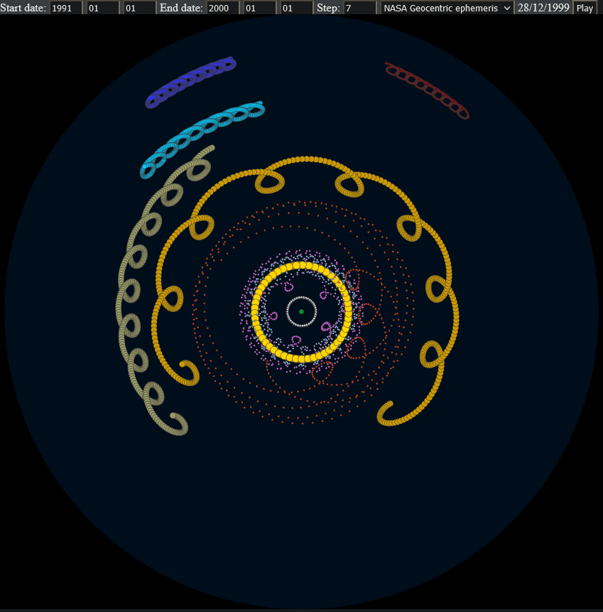
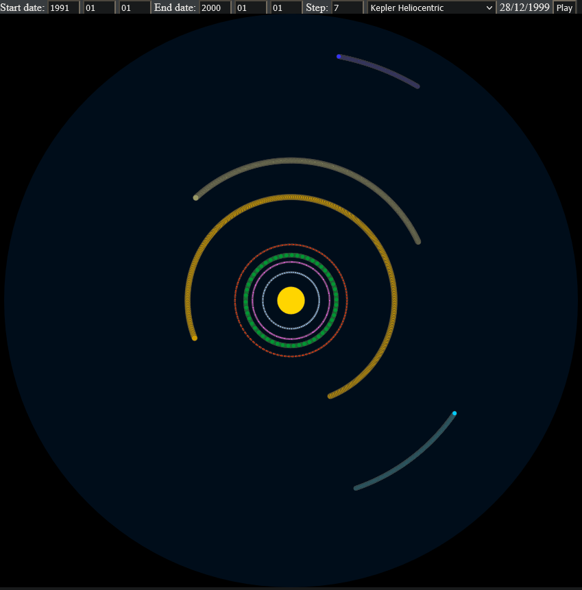

# PlanetsAnimate
 
A bare minimum Horizon API based planet positions animator. Run `serve.js` with node to start a static server, then open `localhost:8080/index.html` in the browser.

## NASA Horizon API mode

In this mode ephemeris needs to downloaded and saved before the animation can run. Run `download_epi.js` to download the ephemeris for required years (edit on line 9-10). Then ephemeris will take some times to download depending on how many years you want to cache.

[More information about the ephemeris](https://ssd-api.jpl.nasa.gov/doc/horizons.htm)

## Kepler Heliocentric mode

This is a simple mathematical estimation based mode. [More information about the equations and parameters](https://orbital-mechanics.space/reference/planetary-ephemeris.html).

